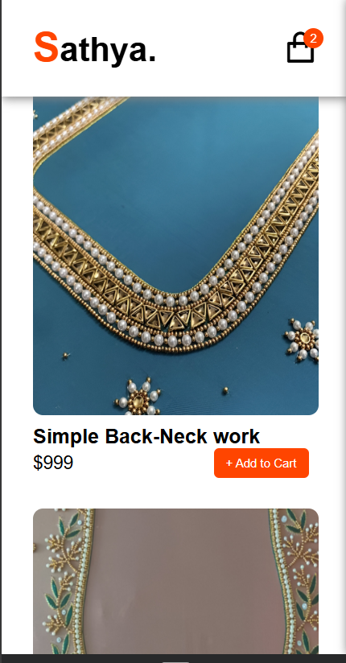

# 🛒 Shopping Cart App

A simple and responsive Shopping Cart web application built using HTML, CSS, and JavaScript. This project demonstrates how a basic e-commerce cart works — users can add items, remove them, and view the total price in real-time.

## 🚀 Features

- Add items to the cart
- Remove items from the cart
- Dynamic total price calculation
- Responsive layout for mobile and desktop
- Lightweight and beginner-friendly code

## 🛠️ Built With

- HTML5
- CSS3
- JavaScript (Vanilla JS)

## 📸 Screenshots

### 🖥 Desktop View  

### 📱 Mobile View  

## 🧠 What I Learned

- DOM manipulation with JavaScript
- Creating interactive UI without any frameworks
- Basic logic for adding/removing items and updating totals
- Structuring small front-end projects

## 🔗 Live Demo

👉 [Check Live Project](https://shopping-cart-47.netlify.app/)

## 🤝 Contributing

Contributions are welcome! Feel free to fork this repository and submit a pull request.

## 📧 Contact

Created by [kuttysathya](https://github.com/kuttysathya) – feel free to reach out if you have feedback or suggestions!
